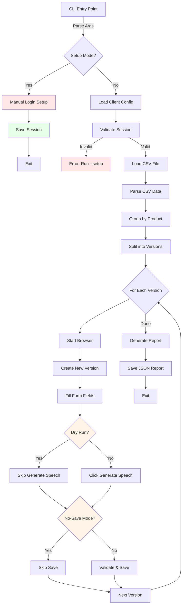

# AGENTS.md

> **Note:** CLAUDE.md is now the authoritative source for Claude Code. This file is maintained for compatibility with other AI coding assistants.

## Table of Contents
1. Commonly Used Commands
2. High-Level Architecture & Structure
3. Key Rules & Constraints
4. Development Hints

## Commands

### Setup & Installation
```bash
# Create virtual environment
python3 -m venv .venv
source .venv/bin/activate  # On Windows: .venv\Scripts\activate

# Install dependencies
pip install -r requirements.txt

# Install Playwright browsers
playwright install chromium
```

### One-time Setup
```bash
# Initial login setup (saves session)
python auto_tts.py --setup
```

### Normal Execution
```bash
# Default run with default config
python auto_tts.py

# With specific client config
python auto_tts.py --client mycompany

# With custom config file
python auto_tts.py --config /path/to/config.json

# Specify CSV file explicitly
python auto_tts.py --csv /path/to/file.csv
```

### Script Automation (Set Live Content)
```bash
# One-time login setup (shares session with auto_faq.py)
python auto_script.py --setup --client example

# Upload scripts from CSV
python auto_script.py --client example --csv scripts.csv

# Delete all scripts from all products (CSV not required)
python auto_script.py --client example --delete-scripts

# Dry run (preview without browser interaction)
python auto_script.py --client example --dry-run --limit 2

# Start from a specific product number
python auto_script.py --client example --start-product 3
```

### Testing & Debugging
```bash
# Dry run (fill forms without generating speech)
python auto_tts.py --dry-run

# No-save mode (generate but don't save)
python auto_tts.py --no-save

# Debug mode (keep browser open)
python auto_tts.py --debug

# Headless mode
python auto_tts.py --headless

# Process subset of versions
python auto_tts.py --start-version 5 --limit 3

# Download specific versions by number
python auto_tts.py --download --versions 0,14-26
```

### CLI Overrides
```bash
# Override config values via CLI
python auto_tts.py --voice "Custom Voice" --max-scripts 5
python auto_tts.py --base-url "https://app.anylive.jp/scripts/XXX"
python auto_tts.py --template "Template_Name"
```

## Architecture

### High-Level Overview
Playwright-based web automation tool for TTS script creation on AnyLive. Includes both CLI (`auto_tts.py`) and macOS menu bar GUI (`menubar_gui.py`) interfaces. Also includes `auto_faq.py` for Product Q&A automation and `auto_script.py` for Set Live Content script upload/deletion.

### Core Components

#### 1. **Configuration System** (`ClientConfig`)
- External JSON-based multi-client configuration in nested directories
- Default config: `configs/default/tts.json` (TTS) and `configs/default/live.json` (FAQ/Script)
- Custom client: `configs/{client}/tts.json` and `configs/{client}/live.json`
- `default/` folder doubles as both template AND fallback config
- Config files support `//` inline comments (loaded via `load_jsonc()`)
- CLI override support for all config values

#### 2. **CSV Parser** (`parse_csv_data`)
- Reads product scripts from CSV files
- Auto-detects CSV in project root (or specify with `--csv`)
- Groups scripts by product name (column B)
- Auto-splits products into multiple versions if >10 scripts per product

**CSV Structure:**
- Column A (No): Product number → used in version name
- Column B (Product Name): Product name → grouping key
- Column E (TH Script): Script content → Section Content fields
- Column G (Audio Code): Audio identifier → Section Title fields

#### 3. **Version Grouping Logic**
- Product-based grouping strategy
- Each product = 1+ versions
- Max scripts per version: configurable (default 10)
- Naming: `{ProductNo}_{ProductName}` or `{ProductNo}_{ProductName}_v2` for overflow

#### 4. **Session Management**
- Browser session persistence via `session_state.json`
- One-time login with `--setup`
- Session validation before execution
- Auto-saves cookies and auth state

#### 5. **Browser Automation** (`TTSAutomation` class)
- Playwright-based web automation
- Resilient selector system with multiple fallback selectors
- Form field filling with retry logic and validation
- Screenshot capture on errors

#### 6. **Logging & Reporting**
- Dual logging: console (INFO) + file (DEBUG)
- Timestamped log files in `logs/`
- JSON execution reports with version-level success/failure tracking
- Error screenshots saved to `screenshots/`

#### 7. **Menu Bar Application** (`menubar_gui.py`)
- Native macOS menu bar integration via `rumps`
- Wraps auto_tts.py functionality in GUI
- Stores data in `~/Library/Application Support/AnyLiveTTS/`
- PyInstaller-ready for .app bundle compilation
- Background threading for async operations

### Data Flow

```
CSV File → parse_csv_data() → List[Version]
    ↓
Version objects grouped by product
    ↓
For each version:
    1. Create version from template
    2. Fill form fields (audio codes, scripts)
    3. Trigger "Generate Speech" buttons
    4. Validate all fields
    5. Save version
    ↓
Generate JSON report
```

### External Dependencies
- **Playwright**: Browser automation
- **pandas**: CSV parsing
- **AnyLive platform**: Target web application (requires authentication)

### Key Files
- `auto_tts.py`: Main automation script (single-file design for app compilation)
- `auto_faq.py`: Product FAQ automation script (CLI)
- `auto_script.py`: Set Live Content script automation (CLI) — upload/delete audio scripts
- `menubar_gui.py`: macOS menu bar application
- `menubar_app.spec`: PyInstaller specification file
- `configs/{client}/tts.json`: TTS client configuration
- `configs/{client}/live.json`: FAQ/Script client configuration
- `session_state.json`: Saved browser session (gitignored)
- `logs/`: Execution logs and JSON reports (gitignored)
- `screenshots/`: Error screenshots (gitignored)
- `browser_data/`: Playwright persistent context (gitignored)

### System Diagram



## Key Rules & Constraints

### Session Management
- **MUST** run `--setup` before first use to save session
- Session file (`session_state.json`) is **NEVER** committed to git
- Session validation happens on every run; if expired, user must re-run `--setup`

### CSV Processing Rules
- CSV encoding priority: UTF-8 → CP874 (Thai encoding fallback)
- Product name forward-fill: Empty cells inherit previous product name
- Product number forward-fill: Empty cells inherit previous product number
- Header row detection: Rows containing "Product Name" or "TH Version" are filtered out
- Empty script validation: Rows must have either `TH Script` OR `Audio Code` to be valid

### Version Naming Rules
- Product names are **sanitized** for version naming:
  - Special characters removed (regex: `[^\w\s-]`)
  - Spaces replaced with underscores
- First chunk: `{ProductNo}_{ProductName}`
- Subsequent chunks: `{ProductNo}_{ProductName}_v2`, `_v3`, etc.

### Form Filling Best Practices
- **Always** wait for form fields to load (`wait_for_form_ready`)
- **Always** validate form fields before saving (`validate_form_fields`)
- Use `clear_and_fill` with retry logic for robust field filling
- Scroll elements into view before interaction
- Add delays (`asyncio.sleep`) after state-changing actions for UI stabilization

### Selector Strategy
- Multiple fallback selectors for resilience (see `SELECTORS` dict)
- Try selectors in order until one succeeds
- Use `safe_click` and `safe_fill` wrappers for robust interaction

### Timeout Configuration
- `DEFAULT_TIMEOUT`: 30s (general waits)
- `CLICK_TIMEOUT`: 8s (element interactions)
- `NAVIGATION_TIMEOUT`: 45s (page navigations)
- `MAX_RETRIES`: 3 (retry attempts)
- `RETRY_DELAY_SECONDS`: 2s (between retries)

### Error Handling
- Screenshot on version processing failure → `screenshots/error_{version}_{timestamp}.png`
- Continue processing next version even if current fails
- Final report tracks success/failure per version

### Configuration Constraints
- `base_url`: Required, must be AnyLive scripts page URL
- `version_template`: Required, must exist in target account
- `voice_name`: Required for voice selection (if enabled)
- `max_scripts_per_version`: Default 10, triggers version split
- `enable_voice_selection`: Default false (voice selection disabled by default)
- `enable_product_info`: Default false (product name/selling point disabled by default)

### Security Considerations [inferred]
- Session file contains authentication cookies → gitignored
- CSV files may contain sensitive product data → gitignored
- Logs may contain sensitive data → gitignored
- **NEVER** commit `session_state.json`, `*.csv`, or `logs/` to version control

## Development Hints

### Adding a New Client Configuration
1. Copy default folder: `cp -r configs/default configs/new_client`
2. Edit config values in `configs/new_client/tts.json` and `configs/new_client/live.json`:
   - `base_url`: Target scripts page URL
   - `version_template`: Template version name
   - `voice_name`: Voice clone name
   - `max_scripts_per_version`: Script limit per version
   - `csv_columns`: Map CSV column names to expected fields
3. Run: `python auto_tts.py --client new_client`

### Adding New Selectors
If AnyLive UI changes and selectors break:
1. Locate the `SELECTORS` dict in auto_tts.py (lines 60-137)
2. Add new selector variations to the appropriate key
3. Selectors are tried in order (most specific first)
4. **Always scope selectors to nearest stable parent** (dialog, modal, card) to avoid ambiguity
5. Use browser DevTools to inspect target elements
6. Test with `--debug` and `--dry-run` flags

### Modifying Version Grouping Logic
Current logic: Product-based grouping
- Located in `parse_csv_data()` function
- Groups by `(product_number, product_name)` tuple
- To change grouping strategy, modify the `product_groups` dictionary creation

### Extending CLI Options
1. Add argument in `main()` parser (line 996+)
2. For config overrides: Add to `cli_overrides` dict (line 1039+)
3. For new functionality: Pass argument to `TTSAutomation` or relevant function

### Debugging Form Filling Issues
1. Use `--debug` flag to keep browser open after execution
2. Check `logs/auto_tts_*.log` for detailed DEBUG-level logs
3. Screenshots saved automatically on errors
4. Use `--dry-run` to test form filling without generating speech
5. Use `--no-save` to test without saving (inspect filled forms manually)

### Testing Session Handling
- Delete `session_state.json` to test fresh login flow
- Run `--setup` multiple times to verify session reuse logic
- Check session validation with expired/invalid session files

### Modifying Wait/Timeout Logic
Key functions with wait logic:
- `wait_for_form_ready()`: Polls for form field count
- `validate_slot_fields()`: Checks field values before operations
- `validate_form_fields()`: Pre-save validation
- `clear_and_fill()`: Retry logic with value verification

### Future App Compilation Considerations
Single-file design intentional for PyInstaller packaging:
- No module imports from other project files
- External configs in `configs/` directory can be bundled as data files
- Session and logs remain external for user data persistence
- Use `--onefile` flag with PyInstaller for standalone executable
- `menubar_app.spec` contains PyInstaller configuration for menu bar app

### Recent UI Changes

Recent commits updated selectors for new AnyLive UI version:
- "Add Version" button selector changes
- "Edit Script" tab click improvements (speed optimization)
- Paragraph card-scoped name locators to avoid hidden fields
- Dialog-scoped selectors to prevent clicking wrong elements

**Key lesson**: When modifying selectors, always scope to nearest stable parent (modal, dialog, card) to avoid ambiguity and prevent clicking hidden/wrong elements.

### Menu Bar App Development

When working on `menubar_gui.py`:
- Use `ui_call()` to schedule UI updates from background threads
- Never call `rumps` UI functions directly from background threads
- Logging goes to `~/Library/Application Support/AnyLiveTTS/logs/menubar.log`
- Check Chromium installation with `check_chromium_installed()` (doesn't launch browser)
- App Support directory structure mirrors repository for consistency
